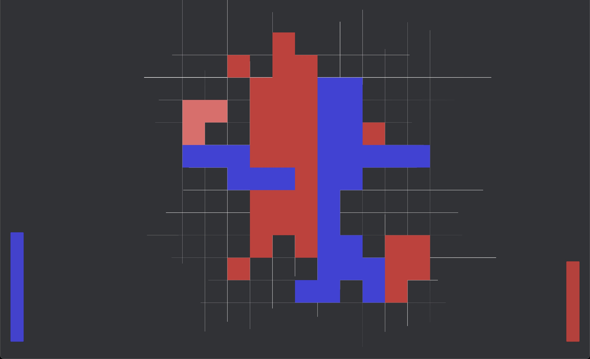

# Reversism
A prototype of a 2 player game that is a mashup of Reversi and Tetris.
It can be played on itch.io https://msgraham.itch.io/reversism

	

## Dependencies
* Unity 6.3

## Known bugs
* there is weirdness around cell capture on the edges of the map
* occasionally a single cell tile is spawned that has its center offset which makes placing it difficult.

## Future Updates
* Tile rotation
* Special cells that apply effects when you place a tile on them. Like scrabble.
* _Juice_